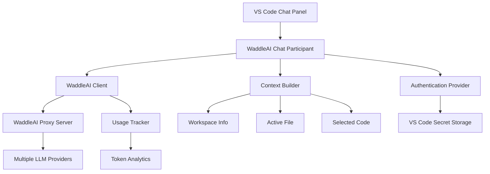

# WaddleAI VS Code Extension

The WaddleAI VS Code Extension integrates WaddleAI's enterprise AI proxy directly into Visual Studio Code, providing seamless access to multiple LLM providers through VS Code's Chat interface.

## Overview

The extension enables developers to:
- **Use WaddleAI models directly in VS Code Chat** - Access GPT-4, Claude, LLaMA, and other models
- **Maintain conversation context** - Workspace and selected code automatically included
- **Stream real-time responses** - See responses appear as they're generated
- **Manage usage and quotas** - Built-in token usage tracking and controls
- **Secure authentication** - API keys stored securely in VS Code's credential store

## Features

### 🚀 Core Functionality
- **Chat Participant Integration** - Use `@waddleai` in VS Code Chat panel
- **Multi-Model Support** - Switch between GPT-4, Claude, LLaMA, and other WaddleAI-supported models
- **Streaming Responses** - Real-time response generation with markdown support
- **Context Awareness** - Automatically includes workspace info and selected code
- **Command Palette Integration** - Full control via VS Code commands

### 🔐 Security & Authentication
- **Secure API Key Storage** - Uses VS Code's built-in credential manager
- **Token Validation** - Real-time validation with WaddleAI server
- **Session Management** - Automatic session creation and management
- **Error Handling** - Comprehensive error handling with actionable messages

### 📊 Usage Management
- **Token Usage Tracking** - Real-time monitoring of WaddleAI token consumption
- **Quota Monitoring** - Visual quota utilization with progress bars
- **Usage Analytics** - Detailed breakdowns by model and time period
- **Export Capabilities** - Usage data export for reporting

### ⚙️ Configuration
- **Flexible Endpoint Configuration** - Point to your WaddleAI proxy instance
- **Model Selection** - Choose default models or switch on-demand
- **Performance Tuning** - Configure temperature, max tokens, and other parameters
- **Memory Management** - Enable/disable conversation memory features

## Installation

### Prerequisites
- **VS Code Version**: 1.85.0 or later
- **WaddleAI Instance**: Running WaddleAI proxy server
- **API Key**: Valid WaddleAI API key (format: `wa-xxxxxxxxx`)

### Option 1: VS Code Marketplace (Coming Soon)
1. Open VS Code
2. Go to Extensions (`Ctrl+Shift+X`)
3. Search for "WaddleAI Chat Participant"
4. Click Install

### Option 2: Manual Installation (Development)
1. Clone the repository:
   ```bash
   git clone https://github.com/waddleai/vscode-extension.git
   cd vscode-extension/waddleai-copilot
   ```

2. Install dependencies:
   ```bash
   npm install
   ```

3. Compile TypeScript:
   ```bash
   npm run compile
   ```

4. Open in VS Code and press F5 to launch Extension Development Host

## Configuration

### Initial Setup
1. **Set API Key**:
   - Open Command Palette (`Ctrl+Shift+P`)
   - Run "WaddleAI: Set API Key"
   - Enter your WaddleAI API key

2. **Configure Endpoint** (if not using default):
   - Go to Settings (`Ctrl+,`)
   - Search for "WaddleAI"
   - Update "Api Endpoint" to your WaddleAI proxy URL

3. **Test Connection**:
   - Command Palette → "WaddleAI: Test Connection"
   - Verify successful connection

### Available Settings

| Setting | Default | Description |
|---------|---------|-------------|
| `waddleai.apiEndpoint` | `http://localhost:8000` | WaddleAI proxy server URL |
| `waddleai.apiKey` | `""` | Your WaddleAI API key |
| `waddleai.defaultModel` | `"gpt-4"` | Default model for chat completions |
| `waddleai.enableMemory` | `true` | Enable conversation memory |
| `waddleai.enableSecurityScanning` | `true` | Enable prompt security scanning |
| `waddleai.maxTokens` | `2048` | Maximum tokens for responses |
| `waddleai.temperature` | `0.7` | Temperature for response generation |

## Usage

### Basic Chat Usage

1. **Open Chat Panel**:
   - View → Chat (`Ctrl+Alt+I`)
   - Or use Command Palette → "Chat: Open Chat"

2. **Start WaddleAI Conversation**:
   ```
   @waddleai Hello! Can you help me write a Python function?
   ```

3. **Get Context-Aware Help**:
   - Select code in your editor
   - Chat with `@waddleai` - selected code is automatically included
   - Ask questions about your workspace and files

### Advanced Usage

#### Model Selection
```
@waddleai I need creative writing help
# Then use Command Palette → "WaddleAI: Select Model" → Choose Claude for creative tasks
```

#### Code Analysis with Context
1. Open a code file
2. Select problematic code
3. Chat: `@waddleai Can you explain this code and suggest improvements?`
4. The extension automatically includes:
   - Selected code
   - File path and language
   - Workspace context

#### Multi-turn Conversations
The extension maintains conversation history:
```
@waddleai Create a REST API endpoint for user registration

# Follow-up (maintains context):
@waddleai Now add input validation and error handling

# Continue the conversation:
@waddleai How would I test this endpoint?
```

### Available Commands

Access via Command Palette (`Ctrl+Shift+P`):

| Command | Description |
|---------|-------------|
| **WaddleAI: Set API Key** | Configure your WaddleAI API key |
| **WaddleAI: Select Model** | Choose from available models |
| **WaddleAI: Test Connection** | Verify connection to WaddleAI proxy |
| **WaddleAI: Show Token Usage** | View detailed usage statistics |
| **WaddleAI: Clear Conversation Memory** | Reset conversation history |

## Context Integration

The extension automatically provides rich context to improve responses:

### Workspace Context
- **Active workspace names** - Helps understand project scope
- **Project structure** - File organization and patterns
- **Currently open files** - Files you're working with

### File Context  
- **Active file path** - Current file being edited
- **Programming language** - Enables language-specific suggestions
- **Selected code** - Specific code segments you're asking about

### Conversation Context
- **Recent chat history** - Maintains conversation flow
- **Previous code examples** - References to earlier discussions
- **Model preferences** - Consistent model usage patterns

### Example Context Message
```
Current workspace: my-python-project
Active file: /src/api/users.py (python)
Selected code:
```python
def create_user(user_data):
    # TODO: Add validation
    return user_data
```

Using model: gpt-4
```

## Token Usage & Analytics

### Usage Dashboard
Access via Command Palette → "WaddleAI: Show Token Usage"

The usage dashboard shows:
- **Total WaddleAI tokens consumed**
- **Request count and patterns**
- **Daily/monthly quota utilization**
- **Model-specific usage breakdown**
- **Time-based usage trends**

### Usage Monitoring
- **Real-time updates** - Live usage tracking during conversations
- **Quota warnings** - Alerts when approaching limits
- **Usage optimization tips** - Suggestions for efficient token usage
- **Export capabilities** - CSV export for detailed analysis

### Sample Usage Data
```json
{
  "total_tokens": 15450,
  "total_requests": 127,
  "daily_quota": {
    "used": 1250,
    "limit": 10000,
    "percentage": 12.5
  },
  "monthly_quota": {
    "used": 15450,
    "limit": 200000,
    "percentage": 7.7
  },
  "model_breakdown": {
    "gpt-4": 8500,
    "claude-3-sonnet": 4200,
    "gpt-3.5-turbo": 2750
  }
}
```

## Error Handling

The extension provides comprehensive error handling with actionable solutions:

### Authentication Errors
**Error**: "Authentication failed. Please check your API key."
- **Solution**: Button to open "WaddleAI: Set API Key" command
- **Cause**: Invalid or expired API key

### Connection Errors  
**Error**: "WaddleAI service unavailable. Please try again later."
- **Solution**: Check WaddleAI proxy server status
- **Cause**: Network issues or server downtime

### Quota Errors
**Error**: "Rate limit exceeded. Please try again later."
- **Solution**: Wait for quota reset or upgrade plan
- **Cause**: Daily/monthly quota exceeded

### Configuration Errors
**Error**: "Failed to fetch models: Connection refused"
- **Solution**: Verify `waddleai.apiEndpoint` setting
- **Cause**: Incorrect proxy server URL

## Troubleshooting

### Common Issues

#### Extension Not Activating
1. Check VS Code version (requires 1.85.0+)
2. Verify extension is enabled in Extensions panel
3. Check console for error messages (Help → Toggle Developer Tools)

#### Chat Participant Not Found
1. Restart VS Code after installation
2. Verify extension compiled successfully (`npm run compile`)
3. Check that `@waddleai` appears in chat autocomplete

#### API Connection Issues
1. Test connection: Command Palette → "WaddleAI: Test Connection"
2. Verify WaddleAI proxy is running and accessible
3. Check firewall/network restrictions
4. Validate API key format (`wa-` prefix required)

#### No Models Available
1. Ensure WaddleAI proxy is properly configured with LLM providers
2. Check API key permissions for model access
3. Verify WaddleAI proxy `/v1/models` endpoint returns data

### Debug Information

#### Enable Debug Logging
1. Open VS Code Settings
2. Search for "Log Level"  
3. Set to "Debug" for detailed logging
4. Check Output panel → "WaddleAI" channel

#### Network Debugging
1. Open Developer Tools (Help → Toggle Developer Tools)
2. Go to Network tab
3. Look for requests to WaddleAI endpoints
4. Check request/response details

#### Extension Logs
```bash
# View extension logs (Linux/macOS)
tail -f ~/.vscode/logs/*/exthost*/output_logging_*/1-WaddleAI.log

# Windows
type %APPDATA%\Code\logs\*\exthost*\output_logging_*\1-WaddleAI.log
```

## Development

### Building from Source
```bash
git clone https://github.com/waddleai/vscode-extension.git
cd vscode-extension/waddleai-copilot
npm install
npm run compile
npm run package  # Requires Node.js 20+
```

### Running Tests
```bash
npm test
npm run lint
npm run typecheck
```

### Project Structure
```
waddleai-copilot/
├── src/
│   ├── extension.ts          # Main extension entry point
│   ├── chatParticipant.ts   # Chat participant implementation  
│   ├── waddleaiClient.ts    # WaddleAI API client
│   ├── authProvider.ts      # Authentication provider
│   └── types/               # TypeScript type definitions
├── package.json             # Extension manifest
├── tsconfig.json           # TypeScript configuration
└── README.md               # Extension documentation
```

### Architecture



## API Integration

### WaddleAI Client API
The extension uses WaddleAI's OpenAI-compatible API:

```typescript
// Stream chat completion
const stream = await client.streamChatCompletion(
  messages,
  model,
  {
    temperature: 0.7,
    max_tokens: 2048,
    enable_memory: true,
    enable_security: true
  }
);

// Process streaming response
for await (const chunk of stream) {
  const content = chunk.choices?.[0]?.delta?.content;
  if (content) {
    // Display in VS Code chat
    chatStream.markdown(content);
  }
}
```

### Context Building
```typescript
// Build context message
const context = [
  `Current workspace: ${workspaceName}`,
  `Active file: ${filePath} (${language})`,
  selectedCode ? `Selected code:\n\`\`\`${language}\n${selectedCode}\n\`\`\`` : '',
  `Using model: ${modelId}`
].filter(Boolean).join('\n\n');
```

## Security Considerations

### Data Privacy
- **Local Processing**: Context building happens locally in VS Code
- **Secure Storage**: API keys stored in VS Code's encrypted credential store  
- **No Data Logging**: Extension doesn't log sensitive code or conversations
- **Configurable Security**: Security scanning can be enabled/disabled

### Network Security
- **HTTPS Support**: Works with HTTPS WaddleAI endpoints
- **Certificate Validation**: Standard certificate validation
- **Timeout Handling**: Request timeouts prevent hanging connections
- **Error Boundaries**: Comprehensive error handling prevents crashes

### Permission Model
The extension requests minimal permissions:
- **File System Access**: Read workspace files for context (when explicitly selected)
- **Network Access**: Connect to configured WaddleAI endpoint
- **Secret Storage**: Store API keys securely
- **UI Integration**: Add chat participant and commands

## Performance

### Optimization Features
- **Streaming Responses**: Real-time response display
- **Context Limiting**: Automatically limits context size to prevent large requests
- **Connection Pooling**: Reuses HTTP connections for efficiency
- **Caching**: Caches model lists and configuration data
- **Error Recovery**: Automatic retry on transient failures

### Resource Usage
- **Memory**: ~5-10MB additional memory usage
- **CPU**: Minimal CPU usage during idle time
- **Network**: Bandwidth depends on conversation frequency and model responses
- **Storage**: <1MB for extension files, minimal for cached data

## Roadmap

### Planned Features
- **Inline Code Suggestions**: Direct code completion integration
- **File Upload Support**: Upload documents for analysis
- **Custom Prompts**: Save and reuse common prompts
- **Team Collaboration**: Share conversations with team members
- **Advanced Analytics**: More detailed usage analytics and insights
- **Plugin Architecture**: Support for custom extensions

### Contributing
The extension is open source. Contributions welcome:
1. Fork the repository
2. Create feature branch
3. Make changes with tests
4. Submit pull request

## Support

### Getting Help
- **Documentation**: This guide and API documentation
- **GitHub Issues**: Report bugs and request features
- **Community**: Join WaddleAI community discussions
- **Enterprise Support**: Available for enterprise customers

### Resources
- **Extension Source**: https://github.com/waddleai/vscode-extension
- **WaddleAI Documentation**: https://docs.waddleai.com
- **VS Code Extension API**: https://code.visualstudio.com/api
- **OpenAI API Compatibility**: https://docs.openai.com/api

---

**Ready to start coding with AI?** Install the WaddleAI VS Code Extension and bring the power of multiple LLMs directly into your development workflow.